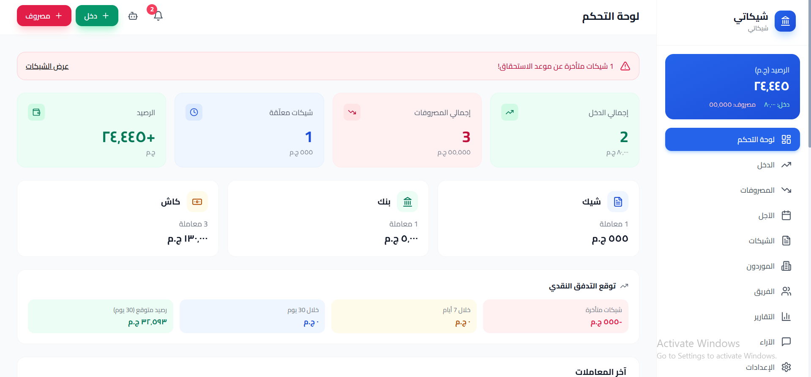

# Shekaty

Shekaty is a fully Arabic financial management platform built for owners of small and medium businesses to manage income, expenses, and checks in one place.

## The Idea

Small business owners often track their money using paper notebooks or scattered spreadsheets, with no single system that brings cash, checks, and deferred payments together. Shekaty solves this with one unified platform.

## Features

- Track balance and cash flow, with alerts for checks approaching their due date
- Full lifecycle management for each check: pending, cashed, or returned
- Categorize income and expenses with reports exportable to Excel
- Owner, manager, and employee roles enforced at the database level (Row Level Security), not just in the UI
- A smart financial assistant that runs locally in the browser and answers using the company's real numbers

## Tech Stack

| Layer | Technology |
|---|---|
| Frontend | React, TypeScript, Tailwind CSS |
| Database & Auth | Supabase (PostgreSQL) |
| Hosting | Cloudflare Pages |

## Screenshot

## About the Project

This project was developed as part of the FinTech Entrepreneurship course in the FinTech program at Cairo University.
